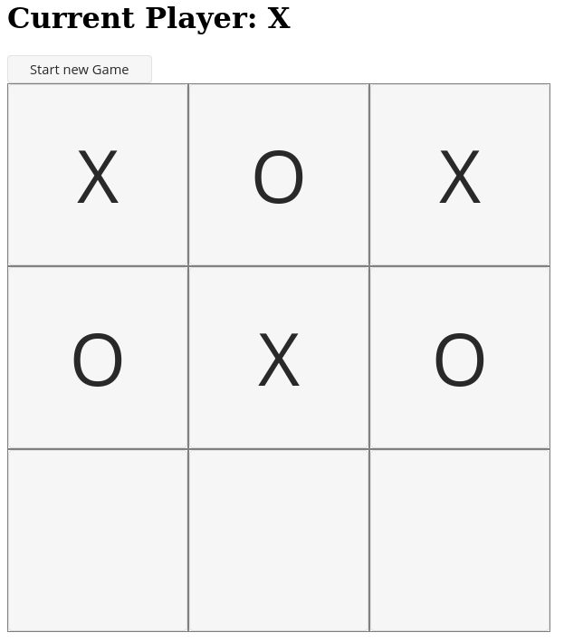

# Tic-Tac-Toe Desktop App ( NgxElectron )



Dependencies Manual

```
npm install -g @angular/cli

npm install --save-dev ngx-electron

npm install --save-dev electron

npm install --save-dev app-root-path
```

Dependencies `package.json` with NPM

```
npm install
```

## Electron app

```
npm run electron
```

## Angular Development server


Run `ng serve` for a dev server. Navigate to `http://localhost:4200/`.

## Code scaffolding

Run `ng generate component component-name` to generate a new component. e.g. `ng generate directive|pipe|service|class|guard|interface|enum|module`.

## Build

Run `ng build` to build the project. The build artifacts will be stored in the `dist/` directory. Use the `--prod` flag for a production build.

## Running unit tests

Run `ng test` to execute the unit tests via [Karma](https://karma-runner.github.io).

## Running end-to-end tests

Run `ng e2e` to execute the end-to-end tests via [Protractor](http://www.protractortest.org/).